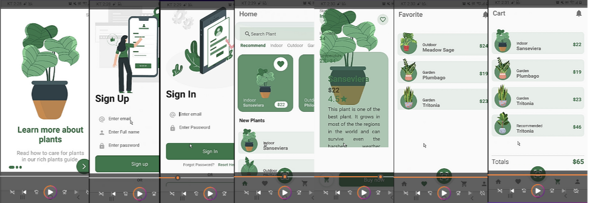

# PlantShop
### Flutter UI Exercise Mini App Plant Shop

## 프로젝트 요약
 
> 2023.01.02 - 2023.01.16   
 
> **Flutter 개인 프로젝트**
* Flutter 위젯에 대한 이해도를 높이고자 진행한 UI 프로젝트입니다.
* UI 주 색깔은 식물 이라는 키워드에 맞게 초록색을 선정하였습니다.
* 플러터를 배우고 난 지 얼마 안된 시점에 제작하였습니다.
* Row, Column, Expanded, Scaffold, FloatingActionButton 등의 위젯의 기본 사용법을 유튜브 강의를 통해 학습한 후 적절히 배치하여 만들었습니다.
* BottomNavigatonBar, PageTransition을 통한 하단 메뉴바에 의한 페이지 이동을 애니메이션으로 구현하였습니다.
 

## Dependency
- `page_transition`:  <a target="_blank" href="https://pub.dev/packages/page_transition">https://pub.dev/packages/page_transition</a>
- `animated_bottom_navigation_bar`: <a target="_blank" href="https://pub.dev/packages/animated_bottom_navigation_bar">https://pub.dev/packages/animated_bottom_navigation_bar</a>

## 시연영상
https://youtu.be/w6mpNLfXnX4
